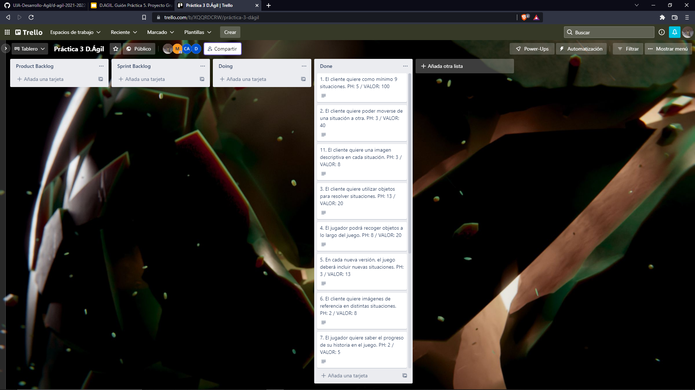

# A Nuclear Winter's Tale

Juego conversacional creado en el framework Undum para la asignatura Desarrollo Ágil.

3º Ingeniería del software - Ingeniería informática

**Trabajo desarrollado por:**

- David Fernández Arenas - dfa00011@red.ujaen.es

- Marco Antonio Carrión Soriano - macs0021@red.ujaen.es

- Carlos Garrido Alcántara - cga00037@red.ujaen.es

- Manuel Ruiz Fernández - mrf00020@red.ujaen.es

## Índice
 1. [Descripción historia conversacional](#historia)
 2. [URL de Trello](#Trello)
 3. [Sprint review](#Review)
 4. [Sprint Retrospective](#Retro)
 5. [Evolución del tablero Trello](#Tablero)
 6. [Métricas](#metrica)
 

## Descripción historia conversacional

**A Nuclear Winter's Tale**

El juego inicia en un refugio nuclear, la guerra nuclear ha sucedido, tú naciste y te criaste en el refugio. Solo has conocido este lugar a lo largo de tu vida, hasta que te enteras que el administrador del refugio lo abrió para comerciar con gente del exterior. Aunque no permite salir a los moradores del refugio, solo él comercia con la gente en base a las necesidades del refugio.

Siempre te habías sentido curioso con el exterior, aunque según la historia del refugio el exterior es un yermo nuclear inhabitable. También te sientes encerrado entre las paredes de un lugar tan pequeño, así que te armas de valor y decides  escapar de allí como puedas para conocer el mundo exterior,aunque tu tía ( la única familia que te queda) no está de acuerdo con ello.

## URL del tablero Trello

URL de Trello: https://trello.com/b/XQQRDCRW/pr%C3%A1ctica-3-d%C3%A1gil

## Sprint Review

**Product Owner: qué se ha “hecho” y qué no**

- La historia 4 se ha completado, se han añadido objetos a la historia para que el usuario pueda utilizarlos en diferentes situaciones.

- La historia 5 se ha completado, en cada nueva versión del juego se han añadido nuevas historias.

- La historia 7 se ha completado, el usuario puede saber su proceso durante el transcurro del juego.

- La historia 8 se ha realizado correctamente, se ha añadido música en el juego para ambientar cada situación.

- La situación 9 se ha conseguido realizar con éxito, hemos añadido diálogos entre el protagonista y otros personajes.

- La historia 10.2 se ha completado, hemos cambiado la letra del juego para que el usuario pueda leer más intuitivamente.

- La historia 11 se ha hecho correctamente, se ha añadido una imagen descriptiva en cada situación.

**Equipo: qué ha ido bien, qué problemas surgieron y qué soluciones dimos**

- Se han completado todas las tareas que hemos seleccionado para el proyecto en este nuevo sprint, junto a nuevas mejoras de anteriores tareas.

- Durante este sprint han surgido problemas como fotos que se superponían, el espaciado entre párrafos y líneas, faltas de ortografía, etc. Pero haciendo un repaso exhaustivo de cada situación hemos conseguido solucionar estos errores menores. 

**¿Por dónde seguir?**

- Si tuviéramos que continuar con el proyecto, podríamos pulir aspectos relacionados con la interfaz, mejorar imágenes e incorporar nuevas historias secundarias como la introducción de un nuevo jefe al que eliminar y alguna misión secundaria que pueda proponer algún personaje secundario.

## Sprint Retrospective
#### ¿Qué ha ido bien?

La organización del proyecto ha ido bien puesto que hemos completado todas las  historias de usuario que habíamos previsto, además de un reparto que pensamos
que ha sido lo más equitativo posible, y todos hemos podido hacer nuestra parte del trabajo adecuadamente.

#### ¿Qué ha ido mal?

A pesar de realizar una buena organización para la realización del proyecto, hemos ido un poco ajustados de tiempo. Por ello, la organización debe ser mejor aunque haya ido bien y establecer mejor los plazos de tiempos en cuanto a la realización de tareas.

#### ¿Qué se puede mejorar?

Se debería intentar dividir el tiempo deberíamos intentar organizarnos de forma que no se acumule todo para los últimos días, haciendo un poco de trabajo cada poco tiempo a lo largo de la semana.

#### ¿Cómo se pueden mejorar?

Haciendo un horario en el cual se coloquen los horarios que cada componente del grupo debe trabajar y cumpliendolos.

## Evolución del tablero de Trello

- **Tablero al comienzo del Sprint**

- **Tablero terminado el segundo sprint**

## Métricas

#### Tabla del proyecto global

#### Gráficas burndown y burn-up de los puntos de historia

#### Tabla del Sprint 2

#### Gráficas burndown y burn-up del Sprint 2

- **Burndown**

- **Burn-Up**

#### Conclusiones

##### Conclusiones respecto al proyecto global.

Como bien podemos observar en las gráficas y en las tablas del proyecto global, los P.H. al final de cada sprint han superado o igualado los P.H. ideales, por lo que podría decirse que se ha cumplido el objetivo. Cabe mencionar que los P.H. que se han ido realizando no se han realizado de una forma progresiva, si no que se ha realizado el trabajo el día de antes de la entrega de las respectivas releases, lo cual es poco ortodoxo, pero también cabe mencionar que los desarrolladores de este proyecto tenían varios proyectos más, por lo que esta progresión está totalmente justificada. 

