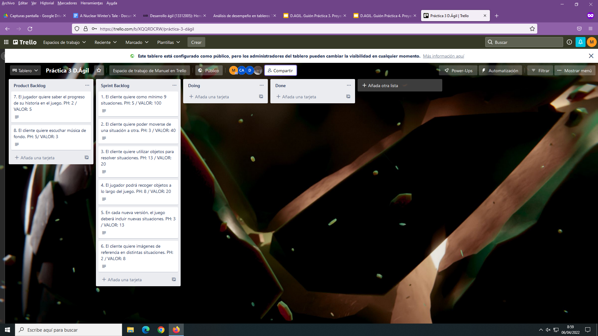

# A Nuclear Winter's Tale

Juego conversacional creado en el framework Undum para la asignatura Desarrollo Ágil.

3º Ingeniería del software - Ingeniería informática

## Índice
 1. [Descripción historia conversacional](#historia)
 2. [URL de Trello](#Trello)
 3. [Sprint review](#Review)
 4. [Sprint Retrospective](#Retro)
 5. [Evolución del tablero Trello](#Tablero)
 6. [Integrantes del proyecto](#Evolución)
 

## Descripción historia conversacional

**A Nuclear Winter's Tale**

El juego inicia en un refugio nuclear, la guerra nuclear ha sucedido, tú naciste y te criaste en el refugio. Solo has conocido este lugar a lo largo de tu vida, hasta que te enteras que el administrador del refugio lo abrió para comerciar con gente del exterior. Aunque no permite salir a los moradores del refugio, solo él comercia con la gente en base a las necesidades del refugio.

Siempre te habías sentido curioso con el exterior, aunque según la historia del refugio el exterior es un yermo nuclear inhabitable. También te sientes encerrado entre las paredes de un lugar tan pequeño, así que te armas de valor y decides  escapar de allí como puedas para conocer el mundo exterior,aunque tu tía ( la única familia que te queda) no está de acuerdo con ello.

## URL del tablero Trello

URL de Trello: https://trello.com/b/XQQRDCRW/pr%C3%A1ctica-3-d%C3%A1gil

## Sprint Review

**Equipo: qué ha ido bien, qué problemas surgieron y qué soluciones dimos**

- En cuanto al Sprint Backlog se ha elegido un reparto más o menos equitativo de valor entre los dos Sprints. 
Hemos cumplido prácticamente todas las historias de usuario, completando primero las historias con un mayor valor, excepto la historia de usuario
donde el cliente quiere nuevas situaciones en cada versión del juego.
Surgieron problemas como muchas faltas de ortografía y se solucionaron dando un repaso general.

- Hubo un atasco a la hora de desarrollar la historia de forma orgánica aunque al final salió correctamente de forma coherente.

- Uno de los problemas que nos surgió fue que muchas de las escenas finales, las cuales no permiten acceder a otra situación, no dejaban claro que eran escenas finales. Este problema lo hemos solucionado añadiendo un resultado a cada situación final, con su propio indicador de final e imagen.

- Otro problema que tuvimos fue repartir la carga de trabajo. Para repartirla de forma igualitaria dividimos las tareas en “subtareas” para cada persona del grupo, por ejemplo en vez de encargar las nueve situaciones a una persona, le encargamos un número equitativo de situaciones a cada miembro del equipo.

**Revisión de plazos**

- Tendremos 20 días para dar una versión definitiva del juego, es algo que vemos posible añadiendo las mejoras mecánicas y lo que consideramos que falta de la historia, sobre todo mejorar la calidad de lo ya hecho y mantenerla para lo nuevo que se añada, intentando de unificar las formas del juego para que no haya unas diferencias significativas a la hora de tomar decisiones o tomar objetos dentro del juego y llevar a cabo diálogos que se entiendan y sean lo más resolutivos posibles.
Además de eso, añadir diálogos, música, cambios 

- La idea sería dedicar las primeras semanas a terminar las situaciones de la historia y la última semana y media en mejorar la calidad de todo y añadir nuevas mecánicas.

## Sprint Retrospective
#### ¿Qué ha ido bien?

Reparto de tareas, esto nos ha permitido que no se haya quedado ninguna parte de la historia que calculamos sin hacer.

Los stats y decisiones funcionan perfectamente, eliges al principio e influyen en toda la historia, no puedes quedarte a medias en una historia atascada.

Creo que la historia ha quedado bastante redonda, clara e interesante.

Todos los desarrolladores han tomado parte creativa en el desarrollo de la historia.

Se pueden usar objetos cosa necesaria para el juego.

El software es funcional tiene bastantes finales y no te puedes quedar bloqueado en ninguna parte.

#### ¿Qué ha ido mal?

Hemos incluido un solo diálogo.

No hemos tenido tiempo de cambiar el css de los textos ni de las ventanas. Pues hemos valorado más dar un software funcional con una historia con un inicio y final, creemos que esta parte se puede desarrollar más adelante.

No hemos unificado del todo la forma en la que queremos ciertas funcionalidades.

Hay objetos sin uso claro actualmente.

Hay partes de la historia que se podrían mejorar a nivel desarrollo.

#### ¿Qué se puede mejorar?

#### ¿Cómo se pueden mejorar?

## Evolución del tablero de Trello

- **Tablero en el primer momento**

- **Tablero después del Product backlog Refinement**

- **Tablero terminado el primer sprint**

## Integrantes del proyecto

Trabajo desarrollado por:

- David Fernández Arenas - dfa00011@red.ujaen.es

- Marco Antonio Carrión Soriano - macs0021@red.ujaen.es

- Carlos Garrido Alcántara - cga00037@red.ujaen.es

- Manuel Ruiz Fernández - mrf00020@red.ujaen.es

